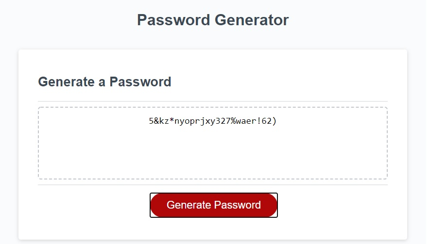
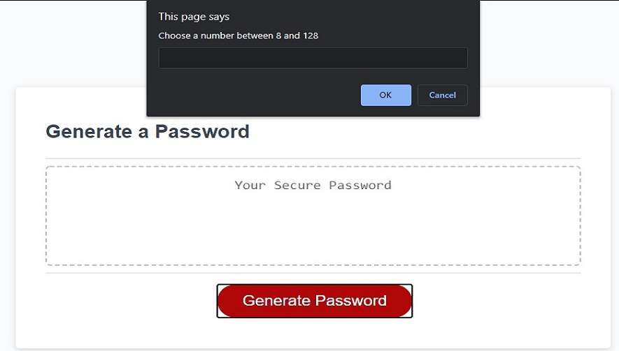
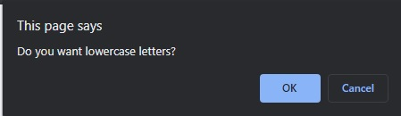
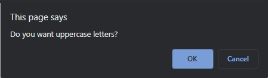
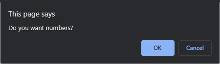
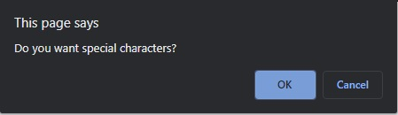
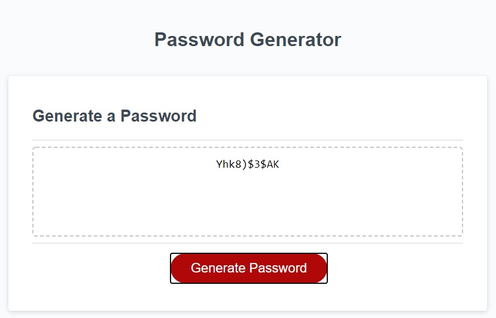

# ```Random Password Generator```

The purpose of this project was to create a random password generator that takes ```FIVE``` inputs:

1. How long the user wants the password to be
2. If they want lowercase letters in the password
3. If they want uppercase letters in the password
4. If they want numbers included in the password
5. If they want special characters included in the password


The password generator would not output a password under the following criteria:

1. If the length of the password requested was below the 8 character minimum 
or above the 128 character maximum.

2. If the password did not include atleast ```ONE``` of the following:

    - lowercase letters 
    - uppercase letters
    - numbers
    - special characters

If the above criteria is not included the password generator will reset until all inputs are
valid.

# ```Screenshots```





## ```The following prompts require one to be chosen to create the password.``` 
## ```If the user selects cancel the generator will not include it in the password.```







## ```Once the user has chosen their custom password the output will display in the```
## ```window above the generate button.```



# ```Created by: Andrew Boyle```

## Project Link

### [Random Password Generator](https://andyb2.github.io/RandomPasswordGenerator/ "Link to project")

